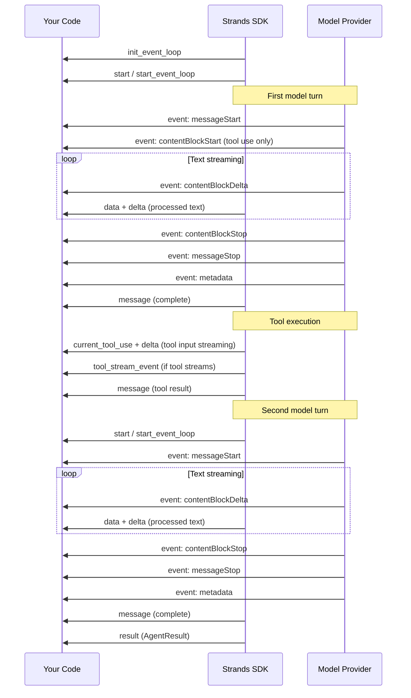

When you iterate over events from `stream_async()` or receive them in a callback handler, each event is a Python dictionary. Knowing what keys to expect—and where each event originates—is essential for building responsive UIs, CLI tools, and monitoring dashboards.

This page documents every event your code can receive during a streaming agent invocation, explains whether it comes from the model provider or the SDK, and highlights differences across providers.

## Event origins

Events fall into two categories based on where they originate.

**SDK lifecycle events** are generated by the Strands SDK itself. They mark boundaries in the agent's execution—when the event loop starts, when a tool executes, when the agent finishes. These events are consistent across all model providers.

**Model pass-through events** originate from the underlying model provider's streaming API (such as Amazon Bedrock, Anthropic, or OpenAI). The SDK wraps them in an `event` key but otherwise passes them through with minimal transformation. Their internal structure follows the [Bedrock Converse Stream API](https://docs.aws.amazon.com/bedrock/latest/APIReference/API_runtime_ConverseStream.html) format, and model providers that don't natively use this format are normalized to it by their Strands model adapter.

:::note[Why this matters for UI development]
If you're building a CLI or chat UI, understanding event origins helps you write robust code. SDK lifecycle events are stable and predictable—you can rely on them for state transitions. Model pass-through events can vary subtly between providers (for example, Amazon Bedrock doesn't emit `contentBlockStart` for text blocks). Designing your UI around SDK events for structure and model events for content keeps things resilient.
:::

## Event lifecycle

A single agent invocation produces events in a predictable sequence. When the model decides to use tools, the cycle repeats—model inference runs again after tool results are added to the conversation.

The following diagram shows the event flow for an invocation where the model generates text, calls a tool, and then generates a final response.



## SDK lifecycle events

These events are emitted by the Strands SDK itself. They are consistent across all model providers.

### `init_event_loop`

Emitted once at the very beginning of agent execution, before any model invocation occurs. This event also includes the invocation state passed to the agent.

```python
{
    "init_event_loop": True,
    # Plus any invocation_state keys passed to the agent
}
```

### `start`

Emitted at the start of each event loop cycle. When the model calls a tool and the loop recurses, you receive this event again before the next model invocation.

```python
{
    "start": True
}
```

:::note
`start` is a legacy event. The `start_event_loop` event (emitted immediately after) serves the same purpose. Both are emitted for backwards compatibility.
:::

### `start_event_loop`

Emitted immediately after `start` to indicate the event loop has begun its core processing. This is the recommended event for detecting cycle boundaries.

```python
{
    "start_event_loop": True
}
```

### `message`

Emitted when a complete message is added to the conversation. This happens in two situations: after the model finishes generating a response, and after tool results are collected. The `role` field tells you which case you're in.

```python
# After model response
{
    "message": {
        "role": "assistant",
        "content": [
            {"text": "The capital of France is Paris."}
        ]
    }
}
```

```python
# After tool execution
{
    "message": {
        "role": "user",
        "content": [
            {
                "toolResult": {
                    "toolUseId": "tool_abc123",
                    "status": "success",
                    "content": [{"text": "42"}]
                }
            }
        ]
    }
}
```

### `data`

Emitted for each text fragment as the model generates it. This is the primary event for displaying streaming text to users. The `data` key contains just the text string, while `delta` contains the raw model delta.

```python
{
    "data": "The capital of ",
    "delta": {"text": "The capital of "},
    # Plus invocation_state keys (agent, model, messages, etc.)
}
```

:::tip[Displaying streaming text]
For most UIs, the `data` key is all you need. Print or append it directly:
```python
if "data" in event:
    print(event["data"], end="", flush=True)
```
:::

### `current_tool_use`

Emitted during tool input streaming. As the model generates the JSON input for a tool call, you receive incremental updates. The `input` field accumulates as streaming progresses—it contains the raw JSON string, not yet parsed.

```python
{
    "type": "tool_use_stream",
    "current_tool_use": {
        "toolUseId": "tooluse_abc123",
        "name": "calculator",
        "input": "{\"expression\": \"42 + "  # Partial, accumulating
    },
    "delta": {"toolUse": {"input": "+ "}},
    # Plus invocation_state keys
}
```

### `tool_stream_event`

Emitted when a tool yields intermediate data during execution. This only occurs with tools that implement [tool streaming](../tools/custom-tools.md#tool-streaming) by yielding values from a generator.

```python
{
    "type": "tool_stream",
    "tool_stream_event": {
        "tool_use": {
            "toolUseId": "tooluse_abc123",
            "name": "my_streaming_tool",
            "input": {"query": "search term"}
        },
        "data": <any value yielded by the tool>
    }
}
```

### `result`

Emitted as the final event of a successful agent invocation. Contains the [`AgentResult`](@api/python/strands.agent.agent_result#AgentResult) object with the stop reason, final message, and metrics.

```python
{
    "result": AgentResult(
        stop_reason="end_turn",
        message={...},
        metrics=EventLoopMetrics(...),
        state={...}
    )
}
```

### `force_stop`

Emitted when agent execution is forcibly terminated because of an unrecoverable error.

```python
{
    "force_stop": True,
    "force_stop_reason": "Error: Connection timeout"
}
```

### `structured_output`

Emitted when [structured output](../agents/structured-output.md) is extracted from a tool call. Contains the parsed Pydantic model instance.

```python
{
    "structured_output": <Pydantic model instance>
}
```

### `event_loop_throttled_delay`

Emitted when the event loop is throttled because of rate limiting. Contains the delay in seconds before the next retry.

```python
{
    "event_loop_throttled_delay": 4,
    # Plus invocation_state keys
}
```

### Reasoning events

These events are emitted when the model produces [extended thinking / reasoning](../model-providers/index.md) content. Not all models support reasoning.

```python
# Reasoning text fragment
{
    "reasoningText": "Let me think about this...",
    "delta": {"reasoningContent": {"text": "Let me think about this..."}},
    "reasoning": True,
    # Plus invocation_state keys
}

# Reasoning signature (verification token)
{
    "reasoning_signature": "abc123...",
    "delta": {"reasoningContent": {"signature": "abc123..."}},
    "reasoning": True,
    # Plus invocation_state keys
}

# Redacted reasoning content
{
    "reasoningRedactedContent": b"...",
    "delta": {"reasoningContent": {"redactedContent": b"..."}},
    "reasoning": True,
    # Plus invocation_state keys
}
```

### Citation events

Emitted when the model provides citation information alongside generated text.

```python
{
    "citation": {
        "location": {...},
        "sourceContent": [...],
        "title": "Source Document"
    },
    "delta": {"citation": {...}},
    # Plus invocation_state keys
}
```

## Model pass-through events

These events originate from the model provider's streaming API and are wrapped in an `event` key. Their internal structure follows the [Bedrock Converse Stream](https://docs.aws.amazon.com/bedrock/latest/APIReference/API_runtime_ConverseStream.html) format. All Strands model adapters normalize provider-specific formats to this structure.

Every model pass-through event has this shape:

```python
{"event": { <stream_event_type>: { <event_data> } }}
```

### `messageStart`

Signals the beginning of a new message from the model.

```python
{"event": {"messageStart": {"role": "assistant"}}}
```

### `contentBlockStart`

Signals the start of a new content block within a message. Contains tool use metadata when the block is a tool call.

```python
# Tool use block start
{
    "event": {
        "contentBlockStart": {
            "contentBlockIndex": 1,
            "start": {
                "toolUse": {
                    "toolUseId": "tooluse_abc123",
                    "name": "calculator"
                }
            }
        }
    }
}
```

:::warning[Provider difference: text blocks]
Amazon Bedrock does **not** emit a `contentBlockStart` event for text content blocks—only for tool use blocks. If you're tracking content blocks by index, be aware that text blocks begin implicitly when you receive the first `contentBlockDelta` with a `text` key. Other providers (such as Anthropic direct API) might emit `contentBlockStart` for text blocks. Don't rely on `contentBlockStart` to detect the beginning of text output.
:::

### `contentBlockDelta`

Contains an incremental content update. The `delta` object has exactly one of the following keys, indicating the type of content.

```python
# Text delta
{
    "event": {
        "contentBlockDelta": {
            "contentBlockIndex": 0,
            "delta": {"text": "Hello, "}
        }
    }
}

# Tool use input delta
{
    "event": {
        "contentBlockDelta": {
            "contentBlockIndex": 1,
            "delta": {"toolUse": {"input": "{\"expr"}}
        }
    }
}

# Reasoning content delta
{
    "event": {
        "contentBlockDelta": {
            "contentBlockIndex": 0,
            "delta": {"reasoningContent": {"text": "Let me think..."}}
        }
    }
}
```

### `contentBlockStop`

Signals the end of a content block.

```python
{
    "event": {
        "contentBlockStop": {
            "contentBlockIndex": 0
        }
    }
}
```

### `messageStop`

Signals the end of the model's message. The `stopReason` tells you why generation stopped.

```python
{
    "event": {
        "messageStop": {
            "stopReason": "end_turn"  # or "tool_use", "max_tokens"
        }
    }
}
```

The possible stop reasons are listed in the table below.

| Stop reason | Meaning |
|-------------|---------|
| `end_turn` | The model finished its response naturally |
| `tool_use` | The model wants to call one or more tools |
| `max_tokens` | The response was truncated at the token limit |

### `metadata`

Contains usage statistics and performance metrics for the model invocation.

```python
{
    "event": {
        "metadata": {
            "usage": {
                "inputTokens": 150,
                "outputTokens": 42,
                "totalTokens": 192
            },
            "metrics": {
                "latencyMs": 1234
            }
        }
    }
}
```

## Provider differences

Because model pass-through events originate from different providers, there are subtle differences in behavior. The table below summarizes the most common variations.

| Behavior | Amazon Bedrock | Anthropic (direct) | OpenAI-compatible |
|----------|---------------|-------------------|-------------------|
| `contentBlockStart` for text blocks | Not emitted | Emitted | Varies by provider |
| `contentBlockIndex` in deltas | Always present | Always present | Can be `None` |
| Reasoning content support | Supported (Claude models) | Supported | Not applicable |
| `metadata` event timing | After `messageStop` | After `messageStop` | Varies |

:::tip[Writing provider-resilient code]
To handle events reliably across providers:

1. Don't rely on `contentBlockStart` to detect text output—use `data` events or check for `text` in `contentBlockDelta` deltas instead
2. Treat `contentBlockIndex` as optional (it can be `None`)
3. Use the SDK-level `data` event for text display rather than parsing raw `contentBlockDelta` events yourself
:::

## Practical example: building a streaming CLI

This example shows how to build a CLI that cleanly displays streaming text and tool calls. It handles the full event lifecycle, tracks state across event loop cycles, and works reliably across model providers.

```python
import asyncio
import sys
from strands import Agent, tool


@tool
def lookup_weather(city: str) -> str:
    """Look up the current weather for a city.

    Args:
        city: The city to look up weather for.
    """
    # Simulated weather data
    weather_data = {
        "seattle": "62°F, cloudy with light rain",
        "new york": "75°F, partly sunny",
        "london": "58°F, overcast",
    }
    return weather_data.get(city.lower(), f"Weather data not available for {city}")


@tool
def calculator(expression: str) -> str:
    """Evaluate a math expression.

    Args:
        expression: The math expression to evaluate.
    """
    return str(eval(expression))


async def run_streaming_cli():
    agent = Agent(
        tools=[lookup_weather, calculator],
        callback_handler=None,
    )

    # Track state for clean output formatting
    is_streaming_text = False
    current_tool_name = None

    async for event in agent.stream_async("What's the weather in Seattle? Also, what is 42 * 17?"):

        # --- SDK lifecycle events ---

        if event.get("start_event_loop"):
            # New event loop cycle (could be a recursive call after tool use)
            is_streaming_text = False
            current_tool_name = None

        elif "data" in event:
            # Streaming text from the model - display it character by character
            if not is_streaming_text:
                is_streaming_text = True
            sys.stdout.write(event["data"])
            sys.stdout.flush()

        elif "current_tool_use" in event:
            tool_info = event["current_tool_use"]
            tool_name = tool_info.get("name")

            if tool_name and tool_name != current_tool_name:
                # New tool call detected
                if is_streaming_text:
                    print()  # End the text line
                    is_streaming_text = False
                current_tool_name = tool_name
                print(f"\n🔧 Calling tool: {tool_name}")

        elif "message" in event:
            msg = event["message"]

            if msg.get("role") == "user":
                # Tool results message
                for content in msg.get("content", []):
                    if "toolResult" in content:
                        result = content["toolResult"]
                        status = result.get("status", "unknown")
                        text = result.get("content", [{}])[0].get("text", "")
                        icon = "✅" if status == "success" else "❌"
                        print(f"   {icon} Result: {text}")

                # Reset state for next model turn
                current_tool_name = None
                is_streaming_text = False

        elif "result" in event:
            # Agent finished
            if is_streaming_text:
                print()  # Final newline after streamed text
            print("\n--- Done ---")

        elif event.get("force_stop"):
            print(f"\n⚠️ Agent stopped: {event.get('force_stop_reason', 'unknown')}")

        # --- Model pass-through events (optional advanced handling) ---

        elif "event" in event:
            raw = event["event"]

            if "messageStop" in raw:
                stop_reason = raw["messageStop"].get("stopReason")
                if stop_reason == "tool_use" and is_streaming_text:
                    print()  # Newline before tool calls
                    is_streaming_text = False


asyncio.run(run_streaming_cli())
```

Running this produces output similar to:

```
I'll help you with both questions. Let me look up the weather in Seattle and calculate that for you.

🔧 Calling tool: lookup_weather
   ✅ Result: 62°F, cloudy with light rain

🔧 Calling tool: calculator
   ✅ Result: 714

The weather in Seattle is currently 62°F, cloudy with light rain. And 42 × 17 = 714.

--- Done ---
```

### Key patterns in the example

The example demonstrates several patterns that are useful for any streaming UI.

**Use `data` for text display, not raw deltas.** The `data` event contains the processed text string. You don't need to parse `contentBlockDelta` events yourself unless you need the raw `contentBlockIndex` for advanced block tracking.

**Track state transitions with lifecycle events.** The `start_event_loop` event tells you a new cycle is beginning—reset your UI state there. The `message` event with `role: "user"` signals tool results are ready.

**Detect tool calls from `current_tool_use`.** When the `name` field first appears (or changes), a new tool call has started. The `input` field accumulates during streaming but isn't useful until the tool actually executes.

**Handle the `result` event for cleanup.** This is always the last event in a successful invocation. Use it to finalize your UI state.

## Related topics

- [Streaming overview](./index.md) for an introduction to streaming approaches
- [Async iterators](./async-iterators.md) for async streaming patterns
- [Callback handlers](./callback-handlers.md) for synchronous event processing
- [Agent loop](../agents/agent-loop.md) for how the event loop drives tool use cycles
